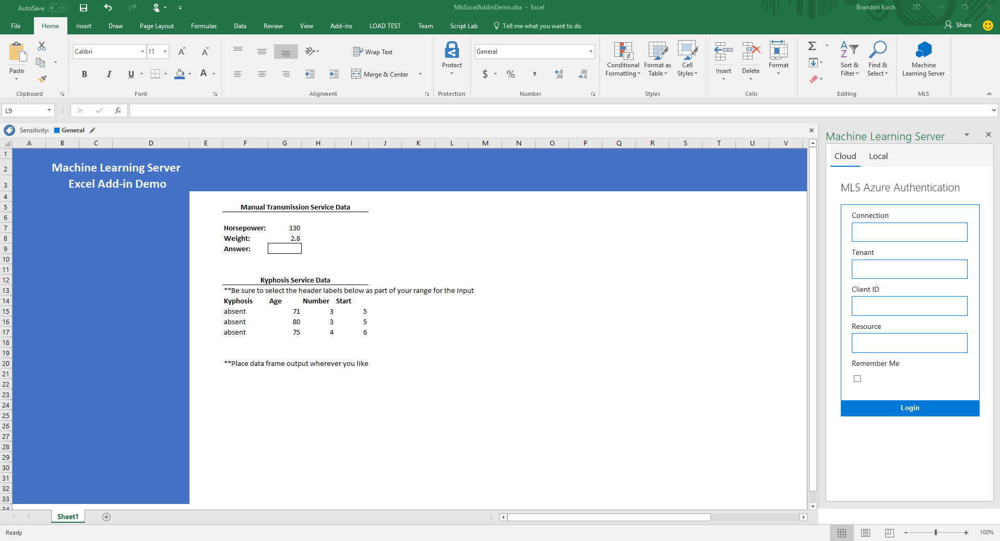
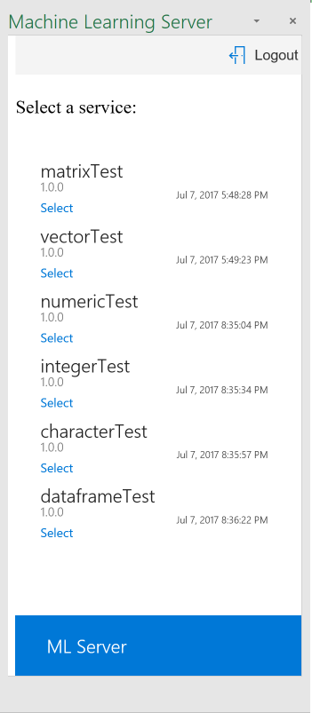
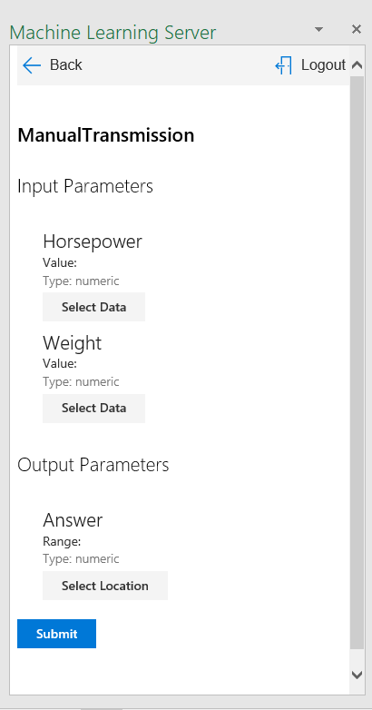
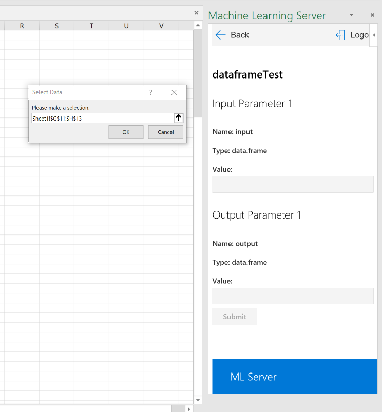
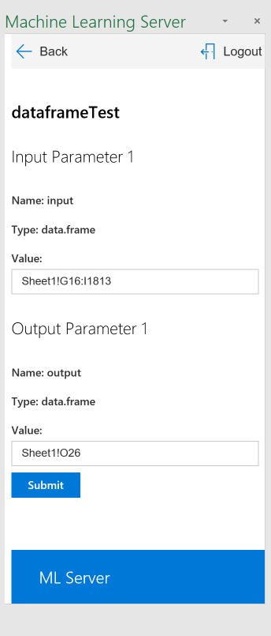

# Machine Learning Server Excel Add-in

## Introduction
This application makes customer web service APIs from the Microsoft Machine Learning Server available for use as an Excel Add-in.  When the add-in is loaded, users can authenticate with their deployed ML Server, pick their desired web service API, and then select data within Excel for each required parameter of the web service.  After which, the user may submit the data and receive an output wherever they specify in the Excel sheet.  The output will dynamically update when input data changes as long as the user stays on that selected service in the Add-in.

## Demo
You may watch the video on YouTube [here](https://www.youtube.com/watch?v=GY2xo4mEl5Q)

## Requirements
Excel 2016 or Office Online

## How to Load the Add-in
The add-in will eventually be available in the Office Add-in Store.  However, for the time being, any users will need to side-load the add-in using Excel 2016 on their local desktop or Excel Online.  To do so, please download the [MlsExcelAddinManifest.xml](MlsExcelAddinManifest.xml) located in the root of this repo.  In order to download this file, **right-click** on the **RAW** version and then click **Save Link As...** in Chrome or **Save Target As...** in Edge/IE and save it as an XML file to your local machine.  It will default to being saved as a .txt, so please verify that you are saving it as a .xml file.  Then follow the instructions listed below:

1. **Excel 2016 Desktop Application**

    - On Windows, follow [this tutorial](https://dev.office.com/docs/add-ins/testing/create-a-network-shared-folder-catalog-for-task-pane-and-content-add-ins)

    - On Mac, follow [this tutorial](https://dev.office.com/docs/add-ins/testing/sideload-an-office-add-in-on-ipad-and-mac)

2. **Office Online**

    - On Office Online, follow [this tutorial](https://dev.office.com/docs/add-ins/testing/sideload-office-add-ins-for-testing)

The add-in is hosted as a web application in this repository via GitHub Pages, and you will be accessing it
in Excel via the XML manifest you downloaded.

## How to Use the Add-in
Once you have loaded the Add-in via the previous tutorials, you may open it from the **Home** tab in Excel.

The image below shows you how the taskpane will look upon loading:

You may choose to authenticate wherever your ML Server is located:

### Cloud

For Cloud authentication, the add-in **currently only supports Azure Active Directory (AAD)**.  So, your ML Server will need to be deployed in Azure in order to make use of this.  The fields required to connect to your Azure deployment of MLS include:

- Connection
    * This is the https location endpoint of your ML Server, such as *https://deploy.excel.addin-test.com*
- Tenant
    * This is the tenant location of your AAD login portal, such as *addin.onmicrosoft.com*
- Client
    * This is the GUID for the client
- Resource
    * This is the GUID for the resource

**NOTE:** If you are using AAD, please add https://microsoft.github.io/ and https://microsoft.github.io/mls-excel-app as endpoints on your Azure deployment of MLS.  Otherwise, you will not be able to access your MLS because Azure will not recognize the Add-in.

If you choose to authenticate via Azure, you will be redirected to your specified Azure Active Directory (AAD) portal.  If you give incorrect specifications for your AAD portal, you will need to reload the add-in by clicking on it again
in the **Home** tab.

### On Premises

* LDAP
* LDAP-S
* Local Administrator

For On Premises authentication, you first **need to ensure CORS is enabled on all of your deployed web nodes**.  To do this, access the *MRS-O16N/webnode/appsettings.json* on each of your web nodes and find *CORS* in the .json file.  If it is currently false and the origins are empty, replace what is currently there with the following:

`"CORS": {"Enabled": true, "Origins": ["https://microsoft.github.io", "https://microsoft.github.io/mls-excel-app"]},`

If it is already set to true, just add the two additional origins listed above.

Then restart your ML Server through the command line administrative utility.

You will also **need to ensure that the endpoint you are trying to connect to can be connected to over HTTPS.  Normal HTTP is not allowed.**  If you are attempting to access http://localhost:12800 or any other *http* endpoint, you will need to create an external endpoint from your machine so that your localhost is securely accessible from the internet via HTTPS.  An easy tool to do this is [ngrok](https://ngrok.com/).  You can download the tool and then unzip the compressed file and double-click the **ngrok.exe** which will open a terminal window from which you can use the command: `ngrok http 12800`.  Ngrok will subsequently give you a forwarding address such as *https://b41f71db.ngrok.io* which you can then use as your secure connection endpoint to access http://localhost:12800 or any other *http* endpoint for the ML Server from the add-in.  You can also use this for any machine for which you don't have HTTPS set up for your deployment of ML Server.

The fields required to connect to your deployment of MLS include:
- Connection
    * This is the https location endpoint of your ML Server 
- Username
    * This is your login username for authentication at your specified endpoint, such as *admin*
- Password
    * This is the password associated with your login username for authentication at your specified endpoint, such as *adminpassword*

If you choose to have the application remember you, your ML Server credentials will be prepopulated every time you load the add-in, so you don't need to input them every time and can simply click **Login**.

### Services

Once you have authenticated, your services will be automatically populated in the application and shown to you as a list.  From this list, you may **Select** the service you want to use.  This is shown in the image below:

### Selected Service

After selecting a service, you will be shown the required input and output parameters and their respective data types that you must give in order to have a successful submission.  All data types that are supported in the Machine Learning Server are supported for the add-in.  Please note that everything is column-wise.  For example, if your data type of your parameter is a vector.  It needs to be a column-vector.  With a data frame, it needs to be columns of data with the labels at the top.

When you click an input or output value field, you will be prompted by Excel to select a range for the parameter.  You may select any range you like in any of the sheets within your workbook.  This is shown in the image below:

When you have selected all of your data, it will be shown to you in the value fields as either a **range** or as the **value** itself, depending on the data type.  This is shown as ranges for data frames in the image below:

When you are satisfied with your parameters, you may receive your initial output by clicking **Submit**.

If there is something incorrect with your parameters, an error of **Parameter Mismatch** will occur on submission and ask you to check your parameters to ensure they are correct before attempting to resubmit.  All data types supported on the ML Server for your services are supported in Excel.  However, when selecting the data, be sure to only select the data and not the column or row labels.

After initial submission, your selected output will continue to update dynamically if you change a value in one of your input fields.  If you leave the service and select another service, they will no longer update.  In the future, the ML Server plans to integrate fully with Excel and have built-in functions similar to SUM where you can place it directly in your sheet and have it be persistent.

If you run into any problems with the application that you believe are in error, feel free to submit an issue on this repository, and we will respond as quickly as we can.  Also, feel free to submit suggestions of what you would like to see for future development.

## How to Further Develop and Test the Code

This application was built using the latest version of Angular 4 in TypeScript.  If you are unfamiliar with Angular, it is recommended that you look through their documentation and tutorials located [here](https://angular.io/guide/quickstart)

### Prerequisites
**Node.js** and **npm** are essential to Angular development.  If you do not already have these installed on your machine, get them [here](https://nodejs.org/en/download/)

This project utilizes the **Angular CLI** for ease of development, deployment, and testing.  You can view the GitHub repo for the CLI [here](https://github.com/angular/angular-cli).  Once you have Node.js and npm installed, you can install the Angular CLI from a terminal using the command: 

`npm install -g @angular/cli`

This project can run on a browser, but the Excel functionality will only work if you side-load the project in **Excel 2016 or Office Online**.  As such, one of these is also a prerequisite for development.

You will also need a code editor.  I recommend using VS Code, which is free; available on Windows, Mac, Linux; has an integrated terminal; Emmet; Intellisense; and integration with GitHub.  You can download it for free [here](https://code.visualstudio.com/).

### Running the Application
After you have the prerequisites installed, open the project directory in your chosen editor.  Then open a terminal in the project root directory.  If you are using VS Code, you can easily do this by the shortcut **Ctrl `** or by opening the **View** menu and clicking **Integrated Terminal**

Once you have your terminal open, to install the necessary dependencies that are listed in the [package.json](package.json) please run:

`npm install`

Now that the dependencies are installed, you need to make one change to the code in order to run it locally.  You need to edit the ADAL config in [src/app/services/auth.service.ts](src/app/services/auth.service.ts).  Find this section in the top of the file:

    // Production development
    redirectUri: window.location.origin + '/mls-excel-app',
    postLogoutRedirectUri: window.location.origin + '/mls-excel-app',
    // Local development
    /* redirectUri: window.location.origin + '/',
    postLogoutRedirectUri: window.location.origin + '/', */

Uncomment the redirect and post logout URIs for local development and comment out the production development ones, if you are running it locally.  You will need to change this back if you deploy to production.

Then you may run the application locally with: 

`ng serve`

The application is located at http://localhost:4200/

Although you can view the application at this location, the Excel functionality will only work if you side-load it in Excel.  Please use [MlsExcelAddinDevManifest.xml](MlsExcelAddinDevManifest.xml) and follow the side-loading instructions listed below:

1. **Excel 2016 Desktop Application**

    - On Windows, follow [this tutorial](https://dev.office.com/docs/add-ins/testing/create-a-network-shared-folder-catalog-for-task-pane-and-content-add-ins)

    - On Mac, follow [this tutorial](https://dev.office.com/docs/add-ins/testing/sideload-an-office-add-in-on-ipad-and-mac)

2. **Office Online**

    - On Office Online, follow [this tutorial](https://dev.office.com/docs/add-ins/testing/sideload-office-add-ins-for-testing)

### Application Architecture Overview
Angular is a framework for building client applications in HTML and in this case, TypeScript, which compiles to JavaScript.  The framework consists of several libraries, some of them core and some optional.

- [package.json](package.json) contains all library dependencies for development and production of the application.  When `npm install` runs, it references this file.
- **node_modules** contains all of the node packages of these libraries for development

You write Angular applications by composing HTML **templates** with Angularized markup, writing  **component** classes to manage those templates, adding application logic in **services**, and boxing component and services in **modules**.

Then you launch the app by *bootstrapping* the *root module*.  Angular takes over, presenting your application content in a browser and responding to user interactions according to the app logic.

- [src](src/) contains all of the application specific code

Within the [src](src/) directory the application logic is primarly located in [app](src/app/) directory which is the only module for this application.  All components and services for the app module are located within that app directory.

The bootstrapping of the Angular application takes place in [src/main.ts](src/main.ts).  This version of main.ts is specially modified to initialize the Office.js context object before bootstrapping the root app module, so that the Excel functionality will work when the app is loaded within Excel.  The [src/index.html](src/index.html) page is what is loaded initially while Angular is bootstrapping the root app module.

#### Application Logic Overview

##### App Module & App Component
In the [app](src/app/) directory: 

- The [app.module](src/app/app.module.ts) is the root module for the project which contains all of the necessary components and services for the logic of the application.  All new components and services added to this module need to be referenced here.

- The [app.routes](src/app/app.routes.ts) determines all navigation throughout the application

- The [app.component](src/app/app.component.ts) is the root component which references the router outlet directive in its HTML template

##### Other Components
All other components are also located in the [app](src/app/) directory.  They are as follows:

- [Authentication](src/app/auth/):
    * [Auth-Admin](src/app/auth/auth-admin/)
        * This component contains the logic for local, LDAP, and LDAP-S authentication
    * [Auth-Azure](src/app/auth/auth-azure/)
        * This component contains the logic for authentication via AAD
- [Web](src/app/web/):
    * [Web-Services](src/web/web-services/)
        * This component contains the logic for listing all web service APIs available to the user
    * [Web-Service](src/web/web-service/)
        * This component contains the logic for a selected web service and its interaction with Excel
- [Header](src/app/header/)
    * This component contains the logic for the navigation bar
- [Footer](src/app/footer/)
    * This component contains the logic for the branded footer
- [Loader](src/app/loader/)
    * Contains the CSS animation for the dot loading animation

##### Models
There is only one model localed in the [models](src/app/models/) directory, which is the [Web Service](src/app/models/web-service.ts) model that contains all of the necessary data about a web service retrieved from the ML Server as well as an extra class called ExcelParameter that has a few extra fields for information about Excel data bindings for the input and output parameters of the web service.

##### Services
All services are contained in the [services](src/app/services/) directory:

- [Auth Service](src/app/services/auth.service.ts)
    * This service contains all of the logic for communicating via HTTP requests for local/LDAP/LDAP-S authentication as well as AAD authentication with the ADAL.js library
    * The ADAL.js library is being used with a wrapper from an npm package called ng2-adal.  The ADAL team does not currently have an official npm package that can be used by Angular
- [Auth Guard](src/app/services/auth-guard.service.ts)
    * Contains all protection logic for web service routes to ensure that the user is authenticated before proceeding to those components
- [Azure Callback](src/app/services/azure-callback.service.ts)
    * Contains all authentication initialization logic for the callback received from the AAD portal after successful authentication
- [MLS Service](src/app/services/mls.service.ts)
    * This service contains all of the logic for communicating via HTTP requests with the ML Server to GET all web services and POST to a specific web service.
- [Excel Service](src/app/services/excel.service.ts)
    * This service contains all of the logic for communicating with the Excel sheet from individual web services.

### Running the Tests
All of the integration/unit tests were written in [Jasmine](https://jasmine.github.io/), using the [Karma Test Runner](https://karma-runner.github.io/1.0/index.html).  You can find all test files next to their respective component or service in the project [src](src) directory.  This is standard practice to place the tests next to the file they're testing.

If you are unfamiliar with Jasmine/Karma, please refer to the Angular documentation located [here](https://angular.io/guide/testing)

Currently the Karma Test Runner runs all the Jasmine tests in the project on Chrome, IE, and Firefox, so please ensure [Google Chrome](https://www.google.com/chrome/browser/desktop/index.html?brand=CHBD&gclid=CjwKCAjw16HLBRBFEiwAElREqOwdw2baDVs4aPux9uuA1DZdb9lWx9KcrasZvIo00mXtYKaHcW12yhoClGoQAvD_BwE) is installed, [Firefox](https://www.mozilla.org/en-US/firefox/new/?scene=2) is installed, and [Internet Explorer](https://www.microsoft.com/en-us/download/internet-explorer.aspx) is installed.  If you would like to disable one of these browsers or add an additional browser to check, please check the [Karma Configuration File](karma.conf.js) and either comment out the browsers you don't want to run or install another browser test runner via npm and add it to the configuration file.

To run the tests, open a terminal at the root directory and use the command `ng test`

This will start the Karma Test Runner, and you should see a Chrome window open automatically where it will run all of the tests and display the results.

If you would like to add a new test file, just ensure that the file name ends with **.spec.ts** and Karma will automatically find it.

### Deployment
This application is currently deployed via **GitHub Pages** in this repository.  If you are unfamiliar with GitHub Pages, please refer to their documentation [here](https://pages.github.com/).

In order to update the deployment, you need to have the project cloned to your development machine as instructed in the beginning of this development section and the necessary prerequisites of Node.js, npm, and the Angular CLI.

You need to edit the ADAL config in [src/app/services/auth.service.ts](src/app/services/auth.service.ts).  Find this section in the top of the file:

    // Production development
    redirectUri: window.location.origin + '/mls-excel-app',
    postLogoutRedirectUri: window.location.origin + '/mls-excel-app',
    // Local development
    /* redirectUri: window.location.origin + '/',
    postLogoutRedirectUri: window.location.origin + '/', */

Comment the redirect and post logout URIs for local development and uncomment the production development ones.  Save the file.  You will need to change this back if you would like to run it locally.

Then open a terminal at the root of the project and use the following command: 

`ng build --prod --output-path docs --base-href mls-excel-app`

This will minify all of the necessary files and place them in the [docs](docs/) directory, which is where GitHub Pages will look for the files needed for them to host the application.  Then push the new files to the master branch.

## License
This project has adopted the [Microsoft Open Source Code of Conduct](https://opensource.microsoft.com/codeofconduct/). For more information see the [Code of Conduct FAQ](https://opensource.microsoft.com/codeofconduct/faq/) or contact opencode@microsoft.com with any additional questions or comments. 

